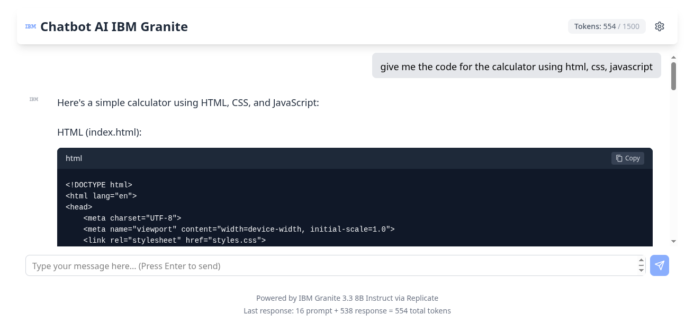

# 🤖 ChatBotAI x IBM

<div align="center">


</div>

---

## 📋 **Project Description**

**ChatBotAI x IBM** adalah aplikasi web chatbot cerdas yang memanfaatkan kekuatan model **IBM Granite 3.3-8B Instruct** untuk memberikan pengalaman percakapan yang natural dan informatif. Aplikasi ini dirancang untuk mendukung berbagai use case mulai dari conversation umum, code generation, text summarization, hingga problem solving dengan advanced reasoning capabilities.

Project ini menggabungkan teknologi AI enterprise-grade dari IBM dengan interface web yang modern dan user-friendly. Aplikasi ini mengintegrasikan kemampuan AI tingkat lanjut dengan antarmuka yang responsif dan mudah digunakan, memberikan solusi chatbot yang powerful untuk berbagai kebutuhan bisnis dan personal.

---

## 🚀 **Technologies Used**

### 🧠 **Model AI yang Digunakan**

#### **IBM Granite 3.3-8b Instruct Model**

- Model ini dirancang untuk menangani tugas-tugas instruction-following umum dan dapat diintegrasikan ke dalam asisten AI di berbagai domain, termasuk aplikasi bisnis

- Model Granite 3.3 memiliki kemampuan reasoning yang ditingkatkan dan dukungan untuk Fill-in-the-Middle (FIM) code completion

- Small language model yang fine-tuned untuk peningkatan reasoning, coding, dan instruction-following

### **Frontend :**

- **React** - Framework yang digunakan untuk frontend dalam menyambungkan API dengan Website

- **Vite** - Tools build untuk membuat framework react

- **JavaScript** - Bahasa pemrograman utama untuk framework frontend

- **HTML5 & TailwindCSS** - Untuk struktur dan styling antarmuka

### **Backend :**

- **Replicate API** - Membantu Menyambungkan dengan Model granite-3.3-8b-instruct tersedia di Replicate

- **REST API** - Untuk komunikasi antara frontend dan backend

- **Node.js** - Membantu dalam membuat API yang disambungkan ke Replicate API

- **Express.js** - Framework yang digunakan untuk Node.js dalam membuat API

### **Deployment :**

- **Vercel** - Platform deployment yang support dengan React(Frontend) dan Express(Backend)

---

## 🎯 **Alasan Pemilihan Teknologi**

### **IBM Granite 3.3-8b Model:**

1. **Efisiensi Computational**: Model Granite 3.0 dirancang sebagai model enterprise yang kecil namun sangat akurat dan efisien

2. **Enterprise-Ready**: Dikembangkan IBM untuk penggunaan enterprise, memprioritaskan kepercayaan, keamanan, dan efisiensi biaya tanpa mengorbankan performa

3. **Versatility**: Dapat digunakan untuk berbagai use case termasuk text generation, classification, summarization, entity extraction, dan customer service chatbots

### **Vercel untuk Deployment:**

1. **Performance**: Optimasi otomatis untuk aplikasi web modern

2. **Scalability**: Auto-scaling berdasarkan traffic

3. **Developer Experience**: CI/CD terintegrasi dengan GitHub

4. **Global CDN**: Distribusi konten global untuk performa optimal

### **Architecture Pattern:**

1. **Separation of Concerns**: Frontend dan backend terpisah untuk maintainability

2. **API-First Approach**: Memungkinkan integrasi dengan berbagai platform

3. **Cloud-Native**: Memanfaatkan layanan cloud untuk scalability

---

## ✨ **Features**

### **Fitur Percakapan Interaktif (Core Chat Interface)**

**Deskripsi Fitur:**

Interface percakapan real-time yang memungkinkan pengguna berinteraksi dengan AI model IBM Granite 3.3-8b melalui chat berbasis web.

**Cara Kerja:**

- User mengetik pertanyaan atau perintah di input field

- Frontend mengirim request ke backend API yang terhubung dengan model Granite 3.3-8b

- Model Granite memberikan respons yang robust untuk creating interactive chatbots, executing precise instructions dan supporting multiple languages

- Respons ditampilkan secara real-time di interface chat

**Fungsi yang Berjalan:**

- Message streaming untuk respons yang smooth

- Auto-scrolling behavior untuk pengalaman chat yang natural

- Message history persistence selama sesi berlangsung

### **Fitur Real-time Response Streaming**

**Deskripsi Fitur:**

Streaming chat messages dari AI provider dengan management chat state dan UI updates otomatis ketika new messages arrive

**Cara Kerja:**

- Menggunakan Vercel AI SDK untuk streaming capabilities

- WebSocket atau SSE (Server-Sent Events) untuk real-time communication

- Progressive loading respons untuk user experience yang lebih baik

- State management untuk handling multiple concurrent conversations

### **Fitur Responsive Design**

**Deskripsi Fitur:**

Interface yang optimal dan dapat menyesuaikan tampilan secara otomatis di berbagai perangkat termasuk desktop, tablet, dan mobile untuk memberikan pengalaman pengguna yang konsisten.

**Cara Kerja:**

- Menggunakan CSS Media Queries untuk mendeteksi ukuran layar dan device orientation

- Implementasi Flexbox/CSS Grid untuk layout yang fleksibel dan adaptif

- Breakpoint system yang mengoptimalkan tampilan untuk range resolusi tertentu (mobile: <768px, tablet: 768px-1024px, desktop: >1024px)

- Touch-friendly controls dengan minimum touch target 44px untuk mobile usability

- Adaptive typography scaling berdasarkan viewport size

**Fungsi yang Berjalan:**

- Auto-adjustment layout container berdasarkan screen width

- Scalable chat interface dengan optimal bubble sizing

### **Fitur Theme System**

**Deskripsi Fitur:**

Interface desain yang dapat diubah menurut preferensi pengguna dengan pilihan System/Light/Dark theme untuk kenyamanan visual dan accessibility.

**Cara Kerja:**

- System Theme: Menggunakan prefers-color-scheme media query untuk mendeteksi preferensi OS pengguna

- Manual Theme Selection: Tombol switcher yang menyimpan preferensi di localStorage/sessionStorage

- CSS Custom Properties (CSS Variables) untuk color scheme management

- Dynamic class switching pada root element untuk theme transitions

- Smooth transition animations antara theme modes

**Fungsi yang Berjalan:**

- Auto-detection system theme pada first load

- Persistent theme preference across sessions

- Contrast optimization untuk accessibility compliance

- Theme-aware icon dan image variations

### **Fitur Custom Configuration**

**Deskripsi Fitur:**

Interface yang memudahkan pengguna dalam mengubah konfigurasi model AI seperti temperature, max tokens, system prompt, dan parameter lainnya untuk customized AI behavior.

**Cara Kerja:**

- Configuration panel dengan intuitive form controls

- Real-time parameter validation dengan immediate feedback

- Preset configuration templates untuk different use cases

**Fungsi yang Berjalan:**

- Temperature control untuk creativity/randomness adjustment

- Max tokens limitation setting untuk response length control

- System prompt customization untuk specific AI personality/behavior

- Model parameter tuning (top-p, frequency penalty, presence penalty)

- Live preview of configuration impact pada AI responses

### **Fitur Error Handling dan Fallback**

**Deskripsi Fitur:**

System yang robust untuk handling berbagai error scenarios dan providing graceful degradation.

**Cara Kerja:**

- API timeout handling dengan retry mechanisms

- Fallback responses ketika model tidak tersedia

- User feedback untuk failed requests

- Graceful error messages yang user-friendly

---

## **Workflow Aplikasi**

### **Flow Kerja Keseluruhan:**

1. User mengakses interface melalui browser

2. Input dikirim ke backend API

3. Backend memproses request ke IBM Granite 3.3-8b model

4. Model memberikan intelligent response

5. Response di-stream kembali ke frontend

6. UI updates secara real-time dengan respons yang diterima

7. Jika respons tidak sesuai yang diinginkan user dapat menyesuaikan inputan pada setting configuration

### **Keunggulan Implementasi:**

- Chatbot-like interface yang memungkinkan users untuk quickly explore, enrich, display, dan improve data untuk AI applications

- User dapat menyesuaikan setinggan dengan yang diinginkan

- Seamless integration antara modern web technologies dengan enterprise-grade AI model

- Scalable architecture yang dapat handle multiple concurrent users

---

## 🔧 **Setup Instructions**

### 📋 **Prerequisites**

Pastikan Anda memiliki software berikut terinstall di sistem:

- **Node.js** (version 16.x atau lebih baru)

- **npm** atau **yarn** package manager

- **Git** untuk version control

- **Replicate Account** (untuk akses IBM Granite model API)

### 1. **Clone Repository**

```bash

git clone https://github.com/machfudn/chatbotai-ibm.git

cd chatbotai-ibm

```

### 2. **Install Dependencies Backend dan Frontend pada root directory**

```bash

# Menggunakan npm

npm run install-all


# Atau menggunakan yarn

yarn install-all

```

### 3. **Environment Configuration**

Buat file `.env` di `backend` dan `frontend` directory dengan mengikuti `.env.example` atau tambahkan konfigurasi berikut:

```

# Environment Backend

REPLICATE_API_TOKEN=api_replicate_model_ibm

NODE_ENV=development

PORT=5000


# Environment Frontend

VITE_API_URL=url_api_backend

```

### 4. IBM Granite API Setup

1. **Buat Replicate Account**: Daftar di [Replicate](https://replicate.com/)

2. **Get API Credentials**: Dapatkan API Token dari akun Anda di Replicate

### 5. Development Server Backend dan Frontend pada root directory

```bash

# Start development server

npm run dev


# Atau dengan yarn

yarn dev

```

Frontend akan berjalan di `http://localhost:5173`

Backend akan berjalan di `http://localhost:5000`

API Endpoint:

GET: `http://localhost:5000/api/health`

| Field     | Tipe   |
| --------- | ------ |
| status    | string |
| message   | string |
| timestamp | string |

POST: `http://localhost:5000/api/chat`

| Field  | Tipe   | Required | Deskripsi                                    |
| ------ | ------ | -------- | -------------------------------------------- |
| prompt | string | ✅       | Teks input dari user yang akan dikirim ke AI |

## **AI Support Explanation**

### **Penggunaan AI dalam Proyek**

Dalam proyek ini, teknologi **Artificial Intelligence (AI)** digunakan secara relevan untuk membangun fitur chatbot interaktif yang dapat merespons pesan pengguna secara dinamis. Proses integrasi AI dilakukan melalui jalur komunikasi antara antarmuka pengguna (frontend) dan server (backend) berbasis Express.js

### **Proses Kerja AI:**

Ketika pengguna mengirimkan pesan melalui website, data tersebut diteruskan ke backend yang kemudian memanfaatkan token API dari layanan Replicate. Token ini digunakan untuk mengakses dan menjalankan model **IBM Granite 3.3-8B Instruct**, yaitu model bahasa besar (Large Language Model) yang memiliki kemampuan pemrosesan teks tingkat lanjut.

### **Kemampuan Model AI:**

Model **IBM Granite 3.3-8B Instruct** memungkinkan sistem menjawab berbagai jenis pesan, termasuk:

1. **Percakapan umum (general conversation)** - Interaksi natural layaknya berbicara dengan manusia

2. **Pembuatan kode program (code generation)** - Generating code dalam berbagai bahasa pemrograman

3. **Rangkuman teks (text summarization)** - Merangkum dokumen panjang menjadi poin-poin penting

4. **Pemecahan masalah kompleks (problem solving)** - Analisis dan solusi untuk masalah yang kompleks

5. **Kemampuan penalaran tingkat lanjut (advanced reasoning capabilities)** - Logical thinking dan analytical processing

### **Dampak Nyata Penggunaan AI:**

Hasil balasan dari model AI ini kemudian dikirim kembali ke frontend dan ditampilkan tepat di bawah pesan pengguna, membentuk alur percakapan layaknya interaksi manusia.

Dengan demikian, penggunaan model **IBM Granite 3.3-8B Instruct** memberikan kontribusi nyata dalam meningkatkan interaktivitas dan kecerdasan respons aplikasi chatbot ini. Model ini tidak hanya menjawab pesan secara kontekstual, tetapi juga memperkaya pengalaman pengguna melalui fleksibilitas dalam menangani berbagai skenario penggunaan.

### **Keunggulan AI Implementation:**

1. **Enterprise-Grade Quality** - Model IBM Granite dirancang khusus untuk aplikasi bisnis dengan standar enterprise

2. **Multi-Domain Expertise** - Kemampuan memahami dan merespons berbagai domain knowledge

3. **Contextual Understanding** - Mempertahankan konteks percakapan untuk interaksi yang lebih natural

4. **Scalable Performance** - Dioptimalkan untuk handling multiple concurrent users

5. **Advanced Reasoning** - Kemampuan analytical thinking untuk problem solving yang kompleks

---

### **Data Flow Process:**

```

User Input → React Frontend → Express.js API → Replicate Service → IBM Granite Model → AI Response → Stream Back → Real-time Display

```

---

## 🌐 **Live Demo**



🔗 **Website**: [chatbotai-ibm-frontend.vercel.app](https://chatbotai-ibm.vercel.app/)

📁 **Repository**: [github.com/machfudn/chatbotai-ibm](https://github.com/machfudn/chatbotai-ibm)

---

<div align="center">

**ChatBotAI x IBM** - Powered by IBM Granite 3.3-8B

Made with ❤️ by [Machfudin](https://github.com/machfudn)

[](https://github.com/machfudn/chatbotai-ibm/stargazers)
[](https://github.com/machfudn/chatbotai-ibm/network)

</div>
